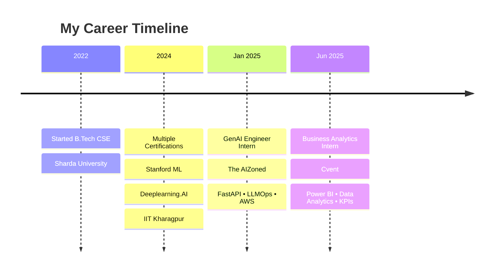

# 🚀 Hey there, I'm Tanuj Saxena! 

<div align="center">
  
</div>

<div align="center">
  
[](https://linkedin.com/in/tanuj-saxena-970271252/)
[](mailto:tanuj.saxena.rks@gmail.com)
[](tel:+918126560686)
[](https://tanuj-saxena-portfolio.vercel.app/)

</div>

---

## 🎯 About Me

```python
class TanujSaxena:
    def __init__(self):
        self.name = "Tanuj Saxena"
        self.role = "GenAI Engineer & Business Analytics Pro"
        self.location = "Greater Noida, India 🇮🇳"
        self.education = "B.Tech CSE @ Sharda University"
        self.interests = ["AI/ML", "LLMOps", "Data Science", "Backend Development"]
        
    def current_work(self):
        return {
            "company": "Cvent",
            "position": "Business Analytics Intern",
            "focus": ["Event Data Analytics", "KPI Dashboards", "A/B Testing"]
        }
    
    def life_motto(self):
        return "Turning data into insights, ideas into innovation! 🚀"

me = TanujSaxena()
print(me.life_motto())
```

---

## 🛠️ Tech Arsenal

<div align="center">

### 🧠 AI & Machine Learning


### 🚀 GenAI & LLMOps


### 📊 Data & Analytics


### ☁️ Cloud & Databases


</div>

---

## 📈 GitHub Stats & Activity

<div align="center">
  
  
</div>

<div align="center">
  
</div>


<div align="center">
  
</div>

---

## 🚀 Featured Projects

<div align="center">

### 🧠 Adaptive AI Questioning System
[](#)
[](#)

*Intelligent tutoring system using IRT & CDM | 30% efficiency boost | 12% retention improvement*

**Tech Stack:** `Python` `TensorFlow` `FastAPI` `Machine Learning`

---

### 🔐 Gait Recognition Authentication
[](#)
[](#)

*Biometric authentication using 3D-CNN | 92% accuracy | 35% security enhancement*

**Tech Stack:** `OpenCV` `Deep Learning` `Computer Vision` `GUI Development`

---

### 📊 Virtual Try-On Pipeline
[](#)
[](#)

*Pose estimation & garment mapping | Production deployment | AWS Integration*

**Tech Stack:** `Computer Vision` `AWS S3` `Docker` `Pose Estimation`

</div>

---

## 💼 Professional Journey



---


## 📊 Development Breakdown

```text
GenAI & LLMOps     ████████████████████░   85%
Business Analytics ██████████████░░░░░░░   65%
Backend Development████████████░░░░░░░░░   55%
Data Science       ███████████████░░░░░░   70%
Cloud Technologies ██████████░░░░░░░░░░░   45%
```

---

## 🌟 Current Focus

<div align="center">
  
🔥 **What I'm working on:**
- 🤖 Advanced LLMOps pipelines at Cvent
- 📊 Real-time analytics dashboards
- 🚀 Multimodal AI model deployment
- 📈 A/B testing frameworks

🌱 **What I'm learning:**
- 🧠 Advanced prompt engineering
- ⚡ Serverless AI architectures  
- 📊 Advanced statistical modeling
- 🔄 MLOps best practices

</div>

---


## 📫 Let's Connect & Collaborate!

<div align="center">

💡 **Open to opportunities in:**
- GenAI Engineering & LLMOps
- Business Analytics & Data Science  
- AI Research & Development
- Startup collaborations

**Let's build something amazing together! 🚀**


</div>

---

<div align="center">
  
</div>
